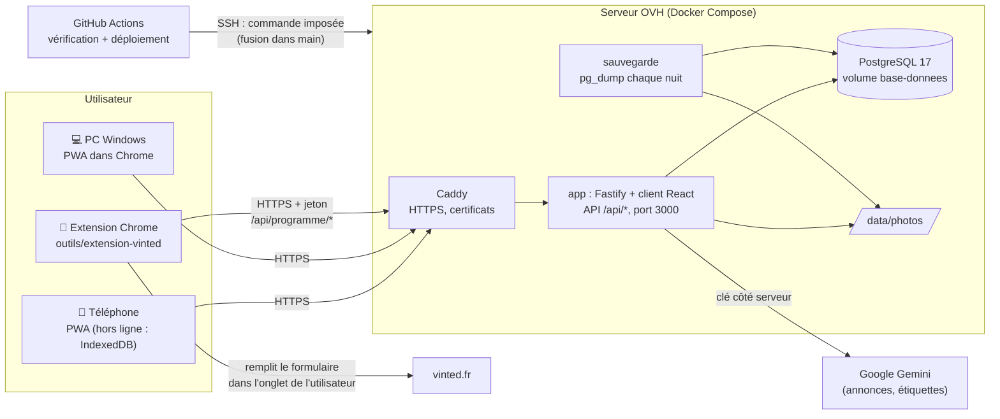
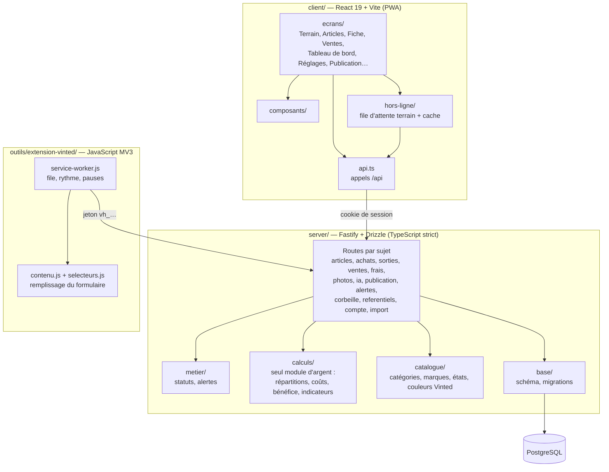
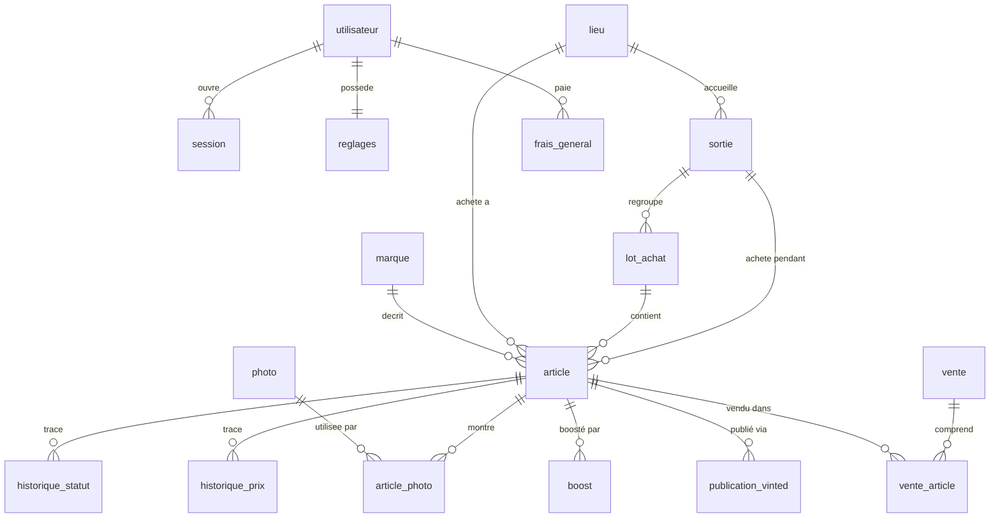

# Architecture de Vinted Helper

Trois vues : l'ensemble (qui parle à qui), le découpage du code, puis le modèle de données. Les schémas sont en
Mermaid : GitHub les affiche directement.

> À jour pour la version **1.5.0**. Ce document est relu et mis à jour à chaque nouvelle version (`/version`).

## 1. Vue d'ensemble

- **Seule** l'extension touche Vinted, et uniquement pour publier (règle n° 4) ; le serveur n'appelle jamais Vinted.
- La clé Gemini ne quitte pas le serveur (règle n° 3).
- Sur le PC de développement, le même `docker-compose.yml` tourne avec Caddy en HTTPS local (Wi-Fi de la maison).

## 2. Découpage du code

## 3. Modèle de données

Chaque table (sauf `utilisateur`) porte un `utilisateur_id`, omis ici pour la lisibilité. Les montants sont en
centimes ; les parts calculées ne sont jamais stockées (règle n° 2).

| Table | Rôle |
|---|---|
| `sortie`, `lieu` | Un vide-grenier (date, lieu, essence) |
| `lot_achat` | Plusieurs articles achetés ensemble pour un prix global |
| `article` | L'objet : prix d'achat, prix affiché, statut, annonce, catégorie Vinted |
| `photo`, `article_photo` | Photos (fichiers dans `data/photos`) et leur ordre sur l'article |
| `historique_statut`, `historique_prix`, `boost` | Suivi dans le temps |
| `vente`, `vente_article` | Une vente (simple ou groupée), retours compris |
| `frais_general` | Frais divers hors articles |
| `publication_vinted` | File d'attente de l'extension et résultat de chaque publication (échec d'une vraie publication → article au statut Erreur) |
| `reglages`, `session`, `marque` | Paramètres de calcul, connexions, marques |
